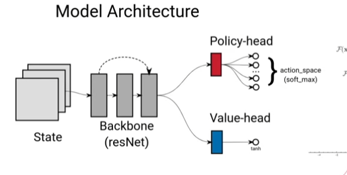

# HOW DOES IT WORK

[Youtube video](https://www.youtube.com/watch?v=wuSQpLinRB4)

[Github with the code for TicTacToe and Connect 4](https://github.com/foersterrobert/AlphaZeroFromScratch)

[Implementation in Colab with details by Francesco](https://colab.research.google.com/drive/1hxLvOp8wdRoS_2nozuYOsRXwUxZ0tdJ6?usp=sharing)

- Train it
- Self play
- Generates training data
- Repeat

In between there is a neural model that gets in input the state (the board) and answers with a policy (for each action, it tells how promising it is) and a value (how promising the state, so the board itself is).

## Monte Carlo Tree Search
It takes a board position and define which plays are more promising for us.
Builds up a tree in the future by taking actions. Each node stores a state (a board), and additionally a value W = total number of wins we achieved when we played this action, and a value N = total number of times we went into that directions. (3,5) means we won 3 of the 5 times we went with this action. 
So when we have the children nodes of the root, we calculate the winning ratio (W/N) and get as an action the one with the highest.

But how can we build a tree like this and get the W?
We do 4 steps:
- Selection: walk down the tree until we reach a leaf node = a node for which we could expand in the future in another direction. Which direction should we pick? We take the child with the highest UCB (ratio + c*sqrt(ln(NN)/N) = highest probability of winning plus least number of times it was visited, where NN is the number of times the parent of the nodes has been visited). Then check if this is a leaf node (if it's not, then continue). At the beginning the leaf node is the root itself. The UCB is calculable only if we have already expanded all the children.
- Expansion: Create a new node by taking a new action not explored. This new node will have W = 0, N = 0
- Simulation: Play randomly into the future until we get where the play is over. When I reach this final state, check if we won or draw or what. ATTENTION: this doesn't generate new nodes with W and N, but only temporary states that are completely useless and discarded at the end of the simulation.
- Backpropagation: we give the info at the final state to all the nodes that are his ancestors (we put +1 in N and if this node is a win then also +1 in W). If I have a draw, I add +0.5 to W

These 4 steps are done at each iteration and this builds the whole tree.
The number of iterations is chosen at the beginning.

### Monte Carlo Tree Search for Alpha Zero
1. Update UBC formula: W/N+policy * c * sqrt(NN)/(1+n). In this case the policy guides us through the tree
2. We get rid of simulation: we just use the value of our neural network that is given to the new node after the expansion.
3. Expansion is done in all the possible directions in one step
=> we have a better search

In every node we store:
* board
* W
* N
* P = policy = probability that was assigned by its parent (for the root we don't have any policy)

- Selection: as before. In this case we calculate the UCB with W/n only if n is not 0.
- In expansion, we call the neural network (f in this case) that give us the value referred to the root state and policy of each action.
(p, v) = f(root)
For each pair we obtain we put W=N=0, while policy P = p (the first of the pair). Then we update our root node to have W = v (value obtained by neural network) and N = 1. (this is the first iteration, in general instead of "root" here reads "the parent of the expanded nodes").
- In backpropagation, for each ancestor of the selected node we add +1 to N and +w to W

## Self Play
* Initial state = blank
* Perform a MCTS and sample the action with the highest winning ratio.
* Next state and switch player
* Perform a MCTS and sample action with highest winning ratio.

...

* We do it until we end the game (WIN, DRAW, LOSE).

Then we want to save all these infos into the training data. For each state we store the list of the winning ratios and the reward = final outcome for our player (+1 or -1 if we won/lost or 0 if draw).

## Training
Take a sample from training data (s=state, pi=winning ratios, z=reward)
Get output from the neural model by passing to it the state (p,v)=f_theta(s)
Minimize loss: l = (z-v)^2+pi*log(p)+c(theta)^2 (it also has regularization)

=> we obtain a new model, so we can use it to play against itself

## Neural network:
The state is a board position. We encode it so that we have 3 "encodings":
- one when +1 played
- one when -1 played (all the fields where player -1 played are 1, everything else is 0)
- one when 0 played (means everything is +1 except for where players played)

=> it's like an image, so we put a CNN:
- Backbone with convolution (resNet architecture, see the paper)
- We split into:
    * policy: conf + 9 neurons (as the output are 9) + softmax
    * value: conf + 1 neuron + tanh

# HIVE IMPLEMENTATION
## State and Action Representation
### State Representation

* Adjacency Matrix: Rows represent pieces, columns represent connection directions
* Graph Representation:

    * Nodes: Each piece becomes a node with features (piece type, owner, etc.)
    * Edges: Connections between pieces in the hexagonal grid
    * Node Features: [piece_type, owner, other_game_state_info]
    * Edge Index: List of [source_node, target_node] pairs

### Action Representation

* Movement: (source_piece_index, destination_position)
* Placement: (piece_type, position_relative_to_existing_pieces)
* Each action should be uniquely identifiable and mappable back to the game state

## MCTS Workflow with GNN

* Initialize Root Node

Create root node with current game state

* Graph Conversion

Convert the adjacency matrix state to graph format:

node_features, edge_index = game.get_graph_representation(state)

* Neural Network Evaluation

Feed graph to your GNN model:

node_embeddings, value = model(node_features, edge_index)

Output:

node_embeddings: Tensor of shape [num_nodes, embedding_dim]

value: Scalar evaluation of the current position (-1 to 1)

* Action Probability Computation

Get valid moves from the game state
Use compute_action_probabilities to convert node embeddings to move probabilities:

action_probs = compute_action_probabilities(node_embeddings, valid_moves, state)

Result: Dictionary mapping each valid move to a probability

* Node Expansion

Expand the current node with the action probabilities
Create child nodes for each valid move

* Tree Search

Perform multiple iterations of selection, expansion, simulation, and backpropagation
Use UCB formula to balance exploration and exploitation

* Move Selection

Return move probabilities based on visit counts of child nodes

## How to Convert Node Embeddings to Action Probabilities
The node embeddings from your GNN contain rich information about each piece's position, relationships, and strategic value. We need to transform these embeddings into scores for each possible move. Here's how:
1. Understanding the Input

Node Embeddings: A tensor of shape [num_nodes, embedding_dim] where each row is a vector representing a piece
Valid Moves: List of possible moves in your game representation
Game State: Current state of the game

2. Basic Approach
For each valid move, we want to compute a score based on:

The piece being moved (source)
Where it's moving to (destination)

3. The "Move Scorer" - Where the Magic Happens
The move scorer can be as simple as a dot product or as complex as a multi-layer perceptron:

4. Training the Move Scorer
You have two main options:

* End-to-end training: The move scorer is part of your GNN model and is trained alongside it through the MCTS self-play loop.
* Separate training: Train a separate model that predicts the value of moves based on expert games or reinforcement learning.

5. Practical Implementation Tips

* Move representation: Create helper functions to extract source and destination from your move representation
* Position embeddings: For positions that aren't currently pieces, average the embeddings of adjacent pieces
* Piece type embeddings: Maintain a learnable embedding for each piece type
* Edge cases: Handle edge cases like the first move of the game when there are no pieces on the board

6. Intuition Behind This Approach
Think of node embeddings as capturing "what's important about this piece right now." The move scorer then learns to recognize "what makes a good move" based on:

* The strategic value of the piece being moved
* The tactical value of the destination position
* The relationship between these two aspects

By training through self-play, your system will learn which combinations of source and destination embeddings lead to winning positions.
This is similar to how human players think: "This piece is important, and moving it to that position would be powerful because of the surrounding pieces and their relationships."

## TODO: how to train the move scorer?