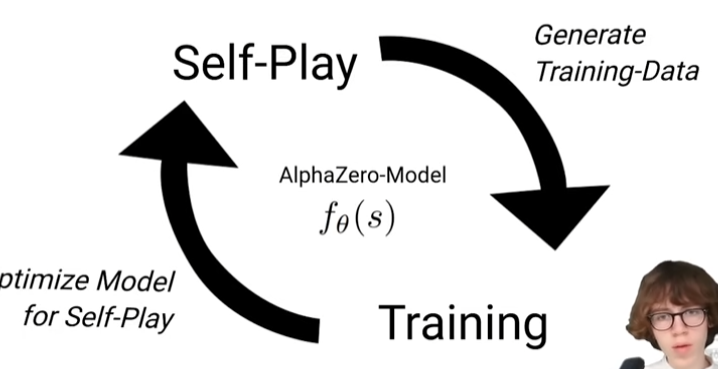

# HOW DOES IT WORK

[Youtube video](https://www.youtube.com/watch?v=wuSQpLinRB4)

[Github with the code for TicTacToe and Connect 4](https://github.com/foersterrobert/AlphaZeroFromScratch)

- Train it
- Self play
- Generates training data
- Repeat

In between there is a neural model that gets in input the state (the board) and answers with a policy (for each action, it tells how promising it is) and a value (how promising the state, so the board itself is).

## Monte Carlo Tree Search
It takes a board position and define which plays are more promising for us.
Builds up a tree in the future by taking actions. Each node stores a state (a board), and additionally a value W = total number of wins we achieved when we played this action, and a value N = total number of times we went into that directions. (3,5) means we won 3 of the 5 times we went with this action. 
So when we have the children nodes of the root, we calculate the winning ratio (W/N) and get as an action the one with the highest.

But how can we build a tree like this and get the W?
We do 4 steps:
- Selection: walk down the tree until we reach a leaf node = a node for which we could expand in the future in another direction. Which direction should we pick? We take the child with the highest UCB (ratio + c*sqrt(ln(NN)/N) = highest probability of winning plus least number of times it was visited, where NN is the number of times the parent of the nodes has been visited). Then check if this is a leaf node (if it's not, then continue). At the beginning the leaf node is the root itself. The UCB is calculable only if we have already expanded all the children.
- Expansion: Create a new node by taking a new action not explored. This new node will have W = 0, N = 0
- Simulation: Play randomly into the future until we get where the play is over. When I reach this final state, check if we won or draw or what. ATTENTION: this doesn't generate new nodes with W and N, but only temporary states that are completely useless and discarded at the end of the simulation.
- Backpropagation: we give the info at the final state to all the nodes that are his ancestors (we put +1 in N and if this node is a win then also +1 in W). If I have a draw, I add +0.5 to W

These 4 steps are done at each iteration and this builds the whole tree.
The number of iterations is chosen at the beginning.

### Monte Carlo Tree Search for Alpha Zero
1. Update UBC formula: W/N+policy*c*sqrt(NN)/(1+n). In this case the policy guides us through the tree
2. We get rid of simulation: we just use the value of our neural network that is given to the new node after the expansion.
3. Expansion is done in all the possible directions in one step
=> we have a better search

In every node we store:
* board
* W
* N
* P = policy = probability that was assigned by its parent (for the root we don't have any policy)

- Selection: as before. In this case we calculate the UCB with W/n only if n is not 0.
- In expansion, we call the neural network (f in this case) that give us the value referred to the root state and policy of each action.
(p, v) = f(root)
For each pair we obtain we put W=N=0, while policy P = p (the first of the pair). Then we update our root node to have W = v (value obtained by neural network) and N = 1. (this is the first iteration, in general instead of "root" here reads "the parent of the expanded nodes").
- In backpropagation, for each ancestor of the selected node we add +1 to N and +w to W

## Self Play
Initial state = blank
Perform a MCTS and sample the action with the highest winning ratio.
Next state and switch player
Perform a MCTS and sample action with highest winning ratio.
...
We do it until we end the game (WIN, DRAW, LOSE).

Then we want to save all these infos into the training data. For each state we store the list of the winning ratios and the reward = final outcome for our player (+1 or -1 if we won/lost or 0 if draw).

## Training
Take a sample from training data (s=state, pi=winning ratios, z=reward)
Get output from the neural model by passing to it the state (p,v)=f_theta(s)
Minimize loss: l = (z-v)^2+pi*log(p)+c(theta)^2 (it also has regularization)

=> we obtain a new model, so we can use it to play against itself

